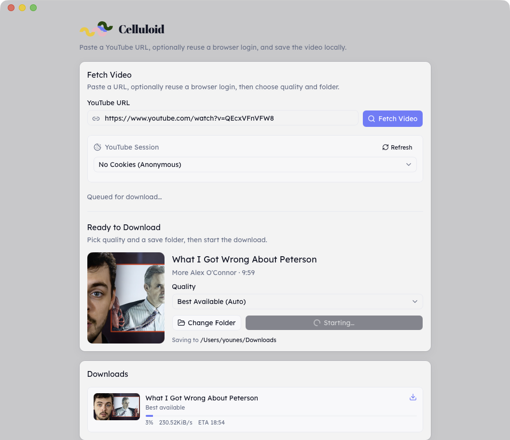

# Celluloid Downloader

Desktop app for [Celluloid](https://celluloid.me) to work with videos, download and upload on major platforms like YouTube, Dailymotion, Vimeo, and Vevo.

## Download

[](https://github.com/celluloid-camp/desktop/releases/latest/download/Celluloid.Downloader-macos-aarch64.dmg)
[](https://github.com/celluloid-camp/desktop/releases/latest/download/Celluloid.Downloader-windows-x64-setup.exe)
[](https://github.com/celluloid-camp/desktop/releases/latest/download/Celluloid.Downloader-linux-amd64.AppImage)

## Screenshot



## Stack

- Tauri 2 + React + TypeScript + Vite
- Tailwind CSS
- Feature-driven frontend (`src/app`, `src/features`, `src/shared`)
- Biome (lint/format)

## Prerequisites

- Rust toolchain ([Tauri prerequisites](https://tauri.app/start/prerequisites/))
- Node.js + pnpm

Sidecars are fetched automatically on `pnpm tauri dev` / build. To fetch manually:

```bash
pnpm sidecars:fetch
# or copy from PATH:
pnpm sidecars:fetch -- --from-path
```

## Scripts

- `pnpm tauri dev` — desktop app (ensures sidecars, then starts)
- `pnpm dev` — web frontend only
- `pnpm sidecars:fetch` — download yt-dlp + ffmpeg for the host triple
- `pnpm build` — typecheck + frontend build
- `pnpm tauri build` — package the desktop app

## Internationalization

UI strings use [Lingui](https://lingui.dev/) (`en` / `fr`). The app picks the desktop language (`navigator.languages`) and falls back to English.

```bash
pnpm lingui:extract   # update catalogs after changing strings
pnpm lingui:compile   # compile .po → runtime messages
```

## Releases

GitHub Releases publish signed builds. macOS builds use Developer ID + notarization. The in-app updater reads `latest.json` from the latest release.
